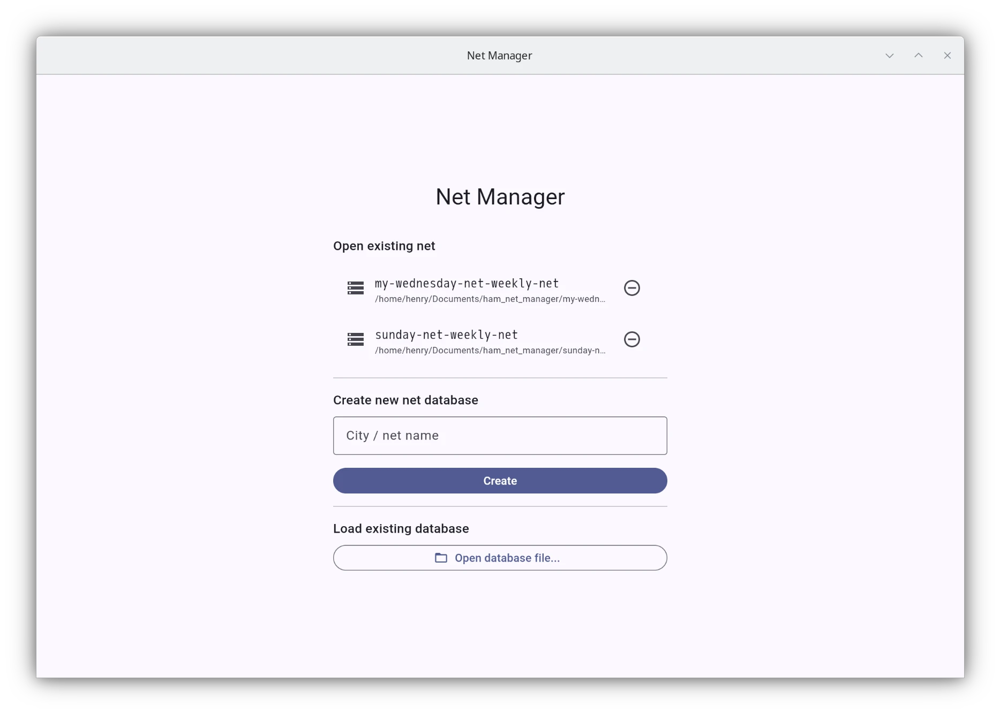
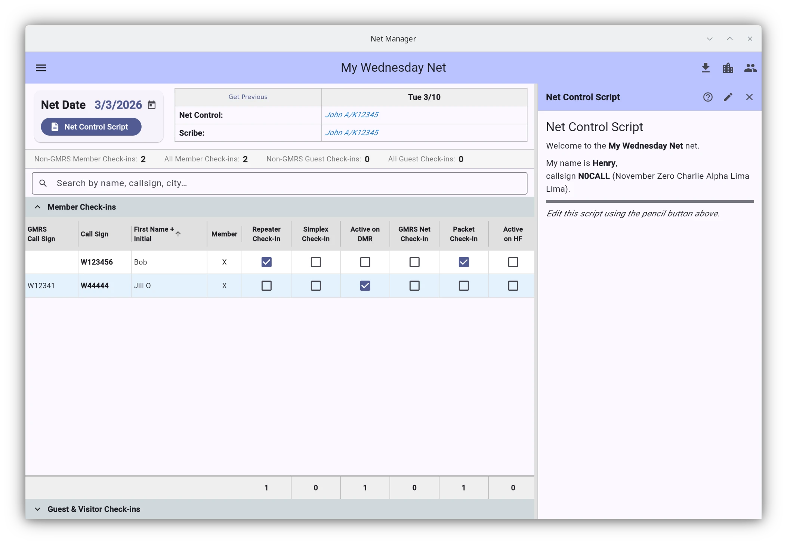
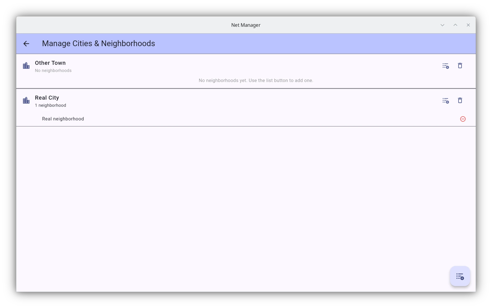
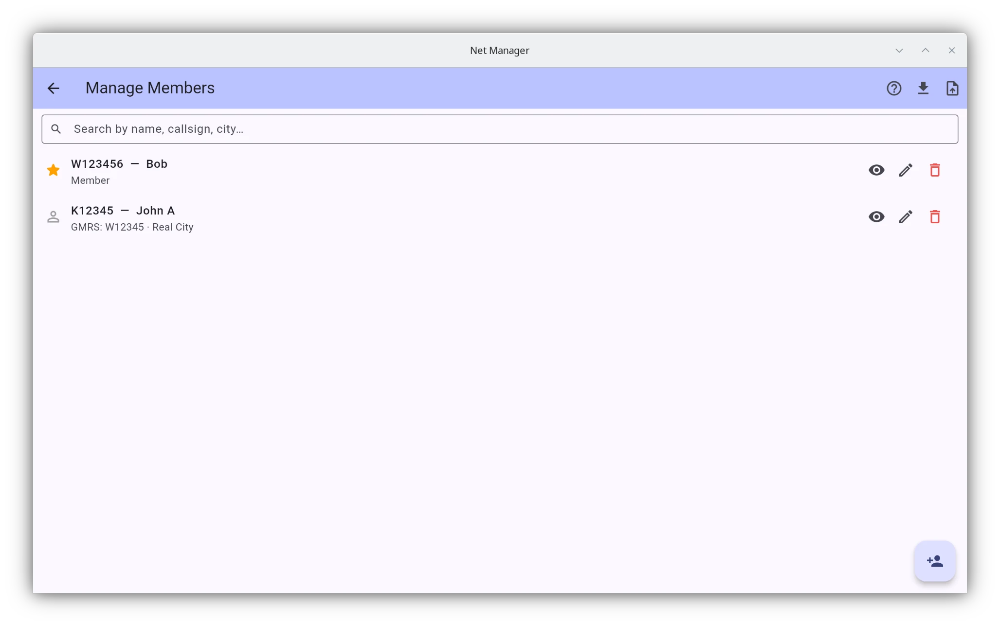
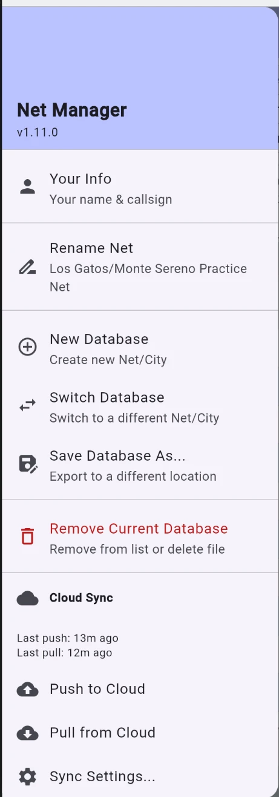
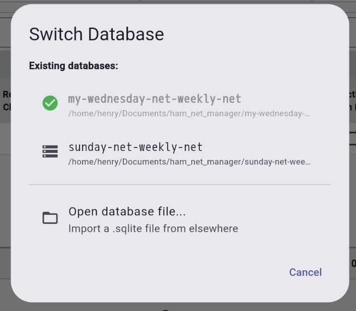
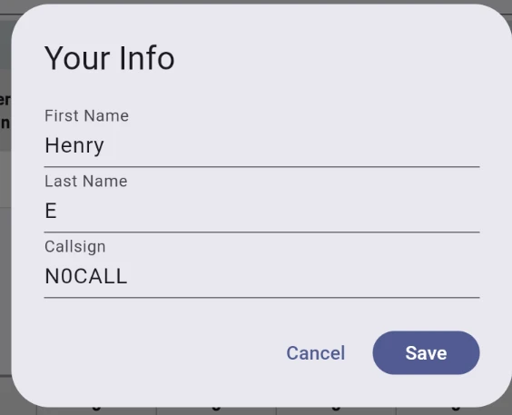

# Ham Net Manager
A Flutter application for managing ham radio nets on Linux (including Raspberry Pi), Windows, Android, and web.  
[Installation](#installation)  
[Screenshots / Manual](#screenshots--manual)  

## Features
- **Multiple Nets and export/import**: Each Net is contained within a SQLite database file that can be imported/exported or overwritten, allowing you to share the database with other operators. App keeps track of what databse files you have opened.
- **Import/Export via CSV files**: Can import/export radio operator data (ie callsign, name, city). Check-in data can be exported to CSV for each date.
- **Markdown Net Control Scripts**: Each net can have its own script with most markdown syntax supported including tables. A few variables are provided to insert your own callsign into the net script.
- **Member Management**: Add/remove radio operators to the net as needed. Operators are stored in each net's database file.
- **Operator search**: Fuzzy search for ham radio operators by multiple fields (ie callsign, first name, city) in the main check-in UI and member management screen.

## Web Version

A web build is available at [hestela.github.io/ham_net_manager](https://hestela.github.io/ham_net_manager/).  
It stores all data within your web browser using the [Origin Private File System (OPFS)](https://developer.mozilla.org/en-US/docs/Web/API/File_System_API/Origin_private_file_system).  
The web interface can export/import SQLite files compatible with desktop versions.  
**Note:** You may want to export the SQLite file after each session, as browser data can be lost (e.g., if your device is low on space, the browser may wipe the data).  
The web interface should work on all modern browsers/OS.

**Limitation:** Internet connection required unless you self-host the app on a webserver in your LAN such as with nginx (HTTPS required due to some of the web technologies used).


## Installation
### Linux
```bash
sudo wget https://github.com/hestela/ham_net_manager/releases/latest/download/Ham_Net_Manager-$(uname -m).AppImage -O /usr/local/bin/ham_net_manager
sudo chmod +x /usr/local/bin/ham_net_manager
```
aarch64 and x86_64 builds are available. App has been tested on Raspberry Pi 4 with Raspberry Pi OS 13 and on Debian 13 x86_64.

### Android
[Download latest apk](https://github.com/hestela/ham_net_manager/releases/latest/download/Ham_Net_Manager.apk)

### Windows
For windows, you will either need to build the app yourself with flutter or you can download an MSIX release but then you will need to install the self-signed code signing certificate that was used to build this app. Otherwise, using the web app is the easiest way.
#### MSIX Install
You will need to "trust" the self-signed certificate that was used to build the MSIX file. You only need to do this once, unless the certificate gets updated.
1. Download the certificate by [clicking here (github link)](https://github.com/hestela/ham_net_manager/raw/refs/heads/main/ham_net_manager.cer)
2. Double-click ham_net_manager.cer
3. "Install Certificate"
4. Select Local Machine
5. "Place all certificates in the following store"
6. Browse
7. Trusted People
8. OK

Now you can install the latest MSIX file.
[Download Latest Windows Release](https://github.com/hestela/ham_net_manager/releases/latest/download/ham_net_manager.msix)
In Windows 11 you can simply double click this file and it will ask if you want to install.
For Windows 10, you will need to open powershell and either cd to the folder with the download, or put the full path to the MSIX file.  
```powershell
Add-AppPackage -Path .\ham_net_manager.msix
```

## Development
See [BUILDING.md](docs/BUILDING.md) for how to build for the different platforms, but you mainly use the flutter command to build/test the app.

## Screenshots / Manual
### Startup Interface
- Can create a new net/database 
- Remove and optionally delete a net


### Main Interface
buttons on the top right are:
- export current check-ins for active date to csv
- manage cities
- manage members/visitors


### Net Control Script
- Click the net control script button to show/hide
- Written with markdown
- Supports a few template variables (like your name, callsign and net name) so that you can substitute your callsign into the net control script. See the (?) help button for more info.
- Click on the pencil icon to edit the script, script is unique to each city/database


### Manage Cities
- Add/remove Cities and Neighborhoods
- Cities and Neighborhoods are optional fields for the member information


### Manage Members
- Fuzzy search on all fields (click esc to clear search)
- "Members" have a star next to their name and Guests/Visitors have the person icon.
- add/remove/edit members here
- can import/export member information via csv
- When importing members, missing cities/neighborhoods will be created. Make sure that your city and neighborhood names don't have typos or small variations otherwise you will have duplicates.


### Navigation Menu
the icon at the top left of the main check-in UI has a so called "hamburger menu" (the 3 stacked lines) which has:
- Your Info (used for net control script mainly)
- Rename Net
- New Database (for new net)
- Switch Database (switch to previously setup net)
- Save Database As (to export sqlite database to a new location)
- Remove current database (to remove current net from history and optionally delete sqlite database file)


### Switch Database/Net


### Your Info
All fields are optional. This data persists between sessions and nets (it is stored in its own json file).


